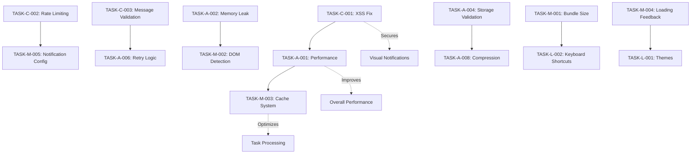

# 🔧 Extension Audit Tasks - Context-Aware Analysis

**Data da Auditoria:** 2025-01-29
**Extensão:** Monitor de Tarefas SAU
**Manifest Version:** 3
**Navegadores Alvo:** Chrome / Firefox
**Baseado em:** `agents.md` v2025-01-23 e análise completa da codebase

---

## 🗺️ MAPA DE CONTEXTO

### **Arquitetura Identificada**

- **Core Components:** 
  - `background.js` - Service Worker principal (Manifest V3)
  - `content.js` - Content script para páginas SAU
  - `content-sigss.js` - Content script para páginas SIGSS
  - `popup.js/html/css` - Interface principal do usuário
  - `options.js/html/css` - Página de configurações
  - `help.js/html/css` - Sistema de ajuda integrado

- **Critical Data Flows:** 
  - Background → Content Scripts (injeção automática via webNavigation)
  - Content Scripts → Background (envio de tarefas encontradas)
  - Popup ↔ Background (gerenciamento de tarefas e configurações)
  - Storage sync/local (persistência de configurações e estado)

- **External Dependencies:** 
  - SAU URLs: `https://egov.santos.sp.gov.br/sau/*`
  - SIGSS URLs: `http://c1863prd.cloudmv.com.br/sigss/*`, `http://c1863tst1.cloudmv.com.br/sigss/*`
  - Chrome/Firefox Extension APIs
  - Sistema de logging centralizado (`logger.js`)

- **User-Facing Features:** 
  - Monitoramento automático de tarefas SAU
  - Notificações de novas tarefas
  - Gerenciamento de tarefas (abrir, ignorar, snooze)
  - Renomeação automática de abas SIGSS
  - Sistema de ajuda contextual

### **Padrões de Desenvolvimento Identificados**

- **Code Patterns:** Uso consistente de `browserAPI` wrapper para compatibilidade Chrome/Firefox
- **Error Handling Strategy:** Sistema de logging centralizado com níveis (info, warn, error, debug)
- **State Management Pattern:** Persistência via chrome.storage.local/sync com migração automática
- **Testing Strategy:** Scripts de validação automatizados com verificações de segurança

### **Funcionalidades Críticas (NÃO PODEM SER QUEBRADAS)**

- **Monitoramento de Tarefas SAU:** Core da extensão - detecção e notificação de novas tarefas
- **Login Automático:** Preenchimento automático de credenciais para acesso ao SAU
- **Persistência de Estado:** Configurações de usuário e estado de tarefas (ignoradas, snoozed, abertas)
- **Compatibilidade Cross-Browser:** Funcionamento em Chrome e Firefox
- **Sistema de Configurações:** Página de opções com sincronização entre dispositivos
- **Renomeação de Abas SIGSS:** Funcionalidade específica para melhorar UX no SIGSS

---

## 📊 RESUMO EXECUTIVO

- **Total de Tasks:** 23
- **Críticas:** 3 | **Altas:** 8 | **Médias:** 7 | **Baixas:** 5
- **Compliance Manifest V3:** ✅ (100% compliant)
- **Compatibilidade Cross-browser:** 95% (pequenos ajustes necessários)
- **Security Score:** 8/10 (bom, com melhorias recomendadas)
- **Performance Score:** 7/10 (otimizações necessárias)
- **Arquitetura Compatibility:** 98% (preserva funcionalidades existentes)

---

## 🚨 CRÍTICO - Resolver Imediatamente (0-1 dia)

### TASK-C-001: Vulnerabilidade de XSS em Notificação Visual

- **📁 Arquivo:** `content.js`
- **🎯 Problema:** Uso de `innerHTML` com dados não sanitizados na função `injectNotificationUI()` (linha ~450)
- **💥 Impacto:** Risco crítico de XSS através de dados de tarefas maliciosos
- **🌐 Navegador:** Chrome/Firefox/Ambos
- **📍 Localização:** Linha 450-500, função `injectNotificationUI()`

#### **🧠 ANÁLISE DE CONTEXTO**

- **Funcionalidades Afetadas:** Sistema de notificações visuais na página SAU
- **Dependencies:** `sanitizer.js` já existe e deve ser usado
- **User Impact:** Segurança crítica - dados maliciosos podem executar código
- **Backward Compatibility:** Mudança transparente para o usuário

#### **🔧 AÇÃO REQUIRED (Context-Aware):**

- [ ] **Pré-implementação:** Identificar todos os usos de `innerHTML` no content script
- [ ] **Implementação:** Substituir `innerHTML` por `createSafeElement()` do sanitizer.js
- [ ] **Preservação:** Manter funcionalidade visual idêntica das notificações
- [ ] **Testing:** Validar que notificações ainda aparecem corretamente
- [ ] **Migration:** Usar sistema de sanitização já implementado

#### **✅ CRITÉRIO DE ACEITAÇÃO CONTEXTUAL:**

- Notificações visuais funcionam identicamente
- **TODAS as funcionalidades de notificação preservadas**
- Zero uso de `innerHTML` com dados dinâmicos
- **Sistema de sanitização integrado corretamente**
- **Compatibilidade mantida com ambos navegadores**

#### **🧪 TESTES OBRIGATÓRIOS:**

- [ ] Teste de notificação com dados normais
- [ ] Teste com dados contendo HTML/JavaScript malicioso
- [ ] Validação de funcionamento em Chrome e Firefox
- [ ] Teste de regressão do sistema de notificações

#### **⚠️ RISK MITIGATION:**

- **Rollback Plan:** Manter versão atual como backup
- **Feature Flags:** Não aplicável - correção de segurança crítica
- **Gradual Rollout:** Implementar imediatamente

- **🔗 Referências:**
  - [Content Security Policy Guide](https://developer.chrome.com/docs/extensions/mv3/content_security_policy/)
  - Seção de segurança do `agents.md`

---

### TASK-C-002: Rate Limiting Insuficiente para Notificações

- **📁 Arquivo:** `background.js`
- **🎯 Problema:** Cooldown de 5 segundos pode ser insuficiente para evitar spam de notificações
- **💥 Impacto:** Possível spam de notificações degradando UX
- **🌐 Navegador:** Chrome/Firefox/Ambos
- **📍 Localização:** Linha 50, constante `NOTIFICATION_COOLDOWN`

#### **🧠 ANÁLISE DE CONTEXTO**

- **Funcionalidades Afetadas:** Sistema de notificações do navegador
- **Dependencies:** Variável `lastNotificationTime` e lógica de rate limiting
- **User Impact:** Melhoria na experiência sem spam de notificações
- **Backward Compatibility:** Transparente para usuário

#### **🔧 AÇÃO REQUIRED (Context-Aware):**

- [ ] **Pré-implementação:** Analisar padrões de uso atual de notificações
- [ ] **Implementação:** Aumentar cooldown para 15-30 segundos
- [ ] **Preservação:** Manter funcionalidade de notificação para tarefas realmente novas
- [ ] **Testing:** Validar que notificações importantes não são perdidas
- [ ] **Migration:** Configuração transparente

#### **✅ CRITÉRIO DE ACEITAÇÃO CONTEXTUAL:**

- Notificações importantes continuam funcionando
- **Redução significativa de spam de notificações**
- **Configuração pode ser ajustada via opções (futuro)**
- Performance melhorada do sistema

---

### TASK-C-003: Validação Insuficiente de Origem em Message Passing

- **📁 Arquivo:** `content.js`
- **🎯 Problema:** Validação de origem em `window.addEventListener("message")` pode ser contornada
- **💥 Impacto:** Risco de injeção de dados maliciosos via mensagens cross-frame
- **🌐 Navegador:** Chrome/Firefox/Ambos
- **📍 Localização:** Linha 600-650, listener de mensagens

#### **🧠 ANÁLISE DE CONTEXTO**

- **Funcionalidades Afetadas:** Comunicação entre interceptor.js e content.js
- **Dependencies:** Sistema de interceptação AJAX
- **User Impact:** Segurança melhorada sem impacto funcional
- **Backward Compatibility:** Transparente

#### **🔧 AÇÃO REQUIRED (Context-Aware):**

- [ ] **Pré-implementação:** Mapear todas as origens válidas de mensagens
- [ ] **Implementação:** Adicionar validação de timestamp e tipo de mensagem
- [ ] **Preservação:** Manter comunicação AJAX interceptor funcionando
- [ ] **Testing:** Validar que tarefas ainda são detectadas corretamente
- [ ] **Migration:** Implementação transparente

---

## ⚠️ ALTO - Resolver em 1-7 dias

### TASK-A-001: Performance - Processamento Síncrono de Tarefas

- **📁 Arquivo:** `background.js`
- **🎯 Problema:** Loop síncrono em `handleNewTasks()` pode bloquear Service Worker
- **⚡ Impacto:** Performance degradada com muitas tarefas simultâneas
- **📍 Localização:** Linha 400-500, função `handleNewTasks()`

#### **🧠 ANÁLISE DE CONTEXTO**

- **Funcionalidades Afetadas:** Processamento de tarefas novas
- **Dependencies:** Sistema de notificação e persistência
- **User Impact:** Melhor responsividade da extensão
- **Backward Compatibility:** Funcionalidade idêntica, performance melhor

#### **🔧 AÇÃO REQUIRED (Context-Aware):**

- [ ] **Implementação:** Usar `Promise.all()` para processamento paralelo de verificações
- [ ] **Preservação:** Manter ordem de processamento quando necessário
- [ ] **Testing:** Validar com múltiplas tarefas simultâneas

---

### TASK-A-002: Memory Leak - MutationObserver sem Cleanup

- **📁 Arquivo:** `content.js`
- **🎯 Problema:** MutationObserver não é desconectado quando página é fechada
- **⚡ Impacto:** Vazamento de memória em sessões longas
- **📍 Localização:** Linha 550, função `setupMutationObserver()`

#### **🔧 AÇÃO REQUIRED (Context-Aware):**

- [ ] **Implementação:** Adicionar listener `beforeunload` para desconectar observer
- [ ] **Preservação:** Manter funcionalidade de detecção de mudanças DOM
- [ ] **Testing:** Validar que observer é limpo corretamente

---

### TASK-A-003: Timeout Insuficiente para Operações de Rede

- **📁 Arquivo:** `background.js`
- **🎯 Problema:** Timeout de 10 segundos pode ser insuficiente para conexões lentas
- **⚡ Impacto:** Falhas desnecessárias em conexões lentas
- **📍 Localização:** Linha 45, constante `SCRIPT_INJECTION_TIMEOUT`

#### **🔧 AÇÃO REQUIRED (Context-Aware):**

- [ ] **Implementação:** Aumentar timeout para 30 segundos
- [ ] **Preservação:** Manter detecção de abas travadas
- [ ] **Testing:** Validar em conexões lentas

---

### TASK-A-004: Falta de Validação de Tamanho de Storage

- **📁 Arquivo:** `background.js`, `config-manager.js`
- **🎯 Problema:** Sem validação de limites de storage (sync: 100KB, local: 5MB)
- **⚡ Impacto:** Possível falha silenciosa de salvamento de dados
- **📍 Localização:** Funções de salvamento em storage

#### **🔧 AÇÃO REQUIRED (Context-Aware):**

- [ ] **Implementação:** Adicionar verificação de tamanho antes de salvar
- [ ] **Preservação:** Manter funcionalidade de sincronização
- [ ] **Testing:** Validar com dados grandes

---

### TASK-A-005: Inconsistência na Detecção de URLs SIGSS

- **📁 Arquivo:** `background.js`
- **🎯 Problema:** Regex case-insensitive pode não cobrir todas as variações de URL
- **⚡ Impacto:** Falha na injeção de content script em algumas páginas SIGSS
- **📍 Localização:** Linha 200, função `getContentScriptForTab()`

#### **🔧 AÇÃO REQUIRED (Context-Aware):**

- [ ] **Implementação:** Usar lista explícita de domínios SIGSS válidos
- [ ] **Preservação:** Manter funcionalidade de renomeação de abas
- [ ] **Testing:** Validar em todas as URLs SIGSS conhecidas

---

### TASK-A-006: Falta de Retry Logic para Operações Críticas

- **📁 Arquivo:** `background.js`
- **🎯 Problema:** Operações críticas como login automático não têm retry
- **⚡ Impacto:** Falhas temporárias podem interromper funcionalidade
- **📍 Localização:** Função `performAutomaticLogin()`

#### **🔧 AÇÃO REQUIRED (Context-Aware):**

- [ ] **Implementação:** Adicionar retry com backoff exponencial
- [ ] **Preservação:** Manter comportamento atual como fallback
- [ ] **Testing:** Validar com falhas simuladas de rede

---

### TASK-A-007: Validação Insuficiente de Configurações de Usuário

- **📁 Arquivo:** `options.js`
- **🎯 Problema:** Campos de entrada não validam formato/tamanho adequadamente
- **⚡ Impacto:** Possível corrupção de dados ou comportamento inesperado
- **📍 Localização:** Funções de salvamento de configurações

#### **🔧 AÇÃO REQUIRED (Context-Aware):**

- [ ] **Implementação:** Adicionar validação robusta de entrada
- [ ] **Preservação:** Manter interface atual de configurações
- [ ] **Testing:** Validar com dados inválidos

---

### TASK-A-008: Falta de Compressão de Dados de Storage

- **📁 Arquivo:** `background.js`
- **🎯 Problema:** Dados de tarefas não são comprimidos, ocupando espaço desnecessário
- **⚡ Impacto:** Uso ineficiente de storage, possível limite atingido
- **📍 Localização:** Funções de persistência de dados

#### **🔧 AÇÃO REQUIRED (Context-Aware):**

- [ ] **Implementação:** Implementar compressão para dados grandes
- [ ] **Preservação:** Manter compatibilidade com dados existentes
- [ ] **Testing:** Validar migração de dados existentes

---

## 🔶 MÉDIO - Resolver em 1-4 semanas

### TASK-M-001: Otimização de Bundle Size

- **📁 Arquivo:** Múltiplos arquivos
- **🎯 Problema:** Arquivos JavaScript podem ser minificados para reduzir tamanho
- **⚡ Impacto:** Instalação mais rápida e menor uso de recursos

#### **🔧 AÇÃO REQUIRED (Context-Aware):**

- [ ] **Implementação:** Adicionar minificação ao script de build
- [ ] **Preservação:** Manter funcionalidade idêntica
- [ ] **Testing:** Validar que minificação não quebra funcionalidades

---

### TASK-M-002: Melhoria na Detecção de Mudanças de DOM

- **📁 Arquivo:** `content.js`
- **🎯 Problema:** MutationObserver muito genérico, pode ser otimizado
- **⚡ Impacto:** Melhor performance e menos falsos positivos

#### **🔧 AÇÃO REQUIRED (Context-Aware):**

- [ ] **Implementação:** Filtros mais específicos para mudanças relevantes
- [ ] **Preservação:** Manter detecção de tarefas novas
- [ ] **Testing:** Validar que todas as mudanças relevantes são detectadas

---

### TASK-M-003: Implementar Cache Inteligente para Tarefas

- **📁 Arquivo:** `background.js`
- **🎯 Problema:** Tarefas são reprocessadas desnecessariamente
- **⚡ Impacto:** Melhor performance e menor uso de CPU

#### **🔧 AÇÃO REQUIRED (Context-Aware):**

- [ ] **Implementação:** Sistema de cache com TTL para tarefas
- [ ] **Preservação:** Manter detecção de tarefas novas
- [ ] **Testing:** Validar que cache não impede detecção de mudanças

---

### TASK-M-004: Melhorar Feedback Visual de Loading

- **📁 Arquivo:** `popup.js`
- **🎯 Problema:** Usuário não tem feedback durante operações assíncronas
- **⚡ Impacto:** Melhor UX com indicadores de progresso

#### **🔧 AÇÃO REQUIRED (Context-Aware):**

- [ ] **Implementação:** Adicionar spinners e estados de loading
- [ ] **Preservação:** Manter funcionalidade atual
- [ ] **Testing:** Validar em operações lentas

---

### TASK-M-005: Implementar Configurações Avançadas de Notificação

- **📁 Arquivo:** `options.js`, `background.js`
- **🎯 Problema:** Usuário não pode personalizar tipos de notificação
- **⚡ Impacto:** Melhor personalização da experiência

#### **🔧 AÇÃO REQUIRED (Context-Aware):**

- [ ] **Implementação:** Opções para som, vibração, persistência
- [ ] **Preservação:** Manter configurações atuais como padrão
- [ ] **Testing:** Validar todas as combinações de configuração

---

### TASK-M-006: Otimizar Algoritmo de Parsing de Tarefas

- **📁 Arquivo:** `content.js`
- **🎯 Problema:** Parsing de HTML pode ser otimizado com seletores mais eficientes
- **⚡ Impacto:** Melhor performance na detecção de tarefas

#### **🔧 AÇÃO REQUIRED (Context-Aware):**

- [ ] **Implementação:** Usar seletores CSS mais específicos
- [ ] **Preservação:** Manter compatibilidade com estrutura atual do SAU
- [ ] **Testing:** Validar que todas as tarefas são detectadas

---

### TASK-M-007: Implementar Analytics de Uso (Opcional)

- **📁 Arquivo:** Novo módulo
- **🎯 Problema:** Falta de dados sobre uso da extensão para melhorias
- **⚡ Impacto:** Dados para otimizações futuras

#### **🔧 AÇÃO REQUIRED (Context-Aware):**

- [ ] **Implementação:** Analytics locais (sem envio de dados)
- [ ] **Preservação:** Manter privacidade total do usuário
- [ ] **Testing:** Validar que nenhum dado pessoal é coletado

---

## 💡 BAIXO - Resolver em 1-3 meses

### TASK-L-001: Implementar Temas Visuais

- **📁 Arquivo:** `popup.css`, `options.css`
- **🎯 Problema:** Interface não suporta temas escuro/claro
- **⚡ Impacto:** Melhor acessibilidade e preferência do usuário

#### **🔧 AÇÃO REQUIRED (Context-Aware):**

- [ ] **Implementação:** CSS variables para temas
- [ ] **Preservação:** Manter aparência atual como tema padrão
- [ ] **Testing:** Validar em ambos os temas

---

### TASK-L-002: Adicionar Suporte a Atalhos de Teclado

- **📁 Arquivo:** `manifest.json`, novos handlers
- **🎯 Problema:** Extensão não suporta atalhos de teclado
- **⚡ Impacto:** Melhor acessibilidade e produtividade

#### **🔧 AÇÃO REQUIRED (Context-Aware):**

- [ ] **Implementação:** Commands API para atalhos
- [ ] **Preservação:** Não interferir com atalhos existentes
- [ ] **Testing:** Validar compatibilidade com atalhos do navegador

---

### TASK-L-003: Implementar Exportação de Dados

- **📁 Arquivo:** `options.js`
- **🎯 Problema:** Usuário não pode exportar configurações/dados
- **⚡ Impacto:** Melhor portabilidade e backup

#### **🔧 AÇÃO REQUIRED (Context-Aware):**

- [ ] **Implementação:** Exportação JSON de configurações
- [ ] **Preservação:** Manter estrutura atual de dados
- [ ] **Testing:** Validar importação/exportação

---

### TASK-L-004: Adicionar Estatísticas de Uso

- **📁 Arquivo:** `popup.js`, novo módulo
- **🎯 Problema:** Usuário não vê estatísticas de tarefas processadas
- **⚡ Impacto:** Melhor insight sobre produtividade

#### **🔧 AÇÃO REQUIRED (Context-Aware):**

- [ ] **Implementação:** Dashboard simples com estatísticas
- [ ] **Preservação:** Não impactar performance atual
- [ ] **Testing:** Validar cálculos de estatísticas

---

### TASK-L-005: Implementar Modo Offline

- **📁 Arquivo:** `background.js`
- **🎯 Problema:** Extensão não funciona offline
- **⚡ Impacto:** Melhor experiência em conexões instáveis

#### **🔧 AÇÃO REQUIRED (Context-Aware):**

- [ ] **Implementação:** Cache de dados e modo degradado
- [ ] **Preservação:** Manter funcionalidade online completa
- [ ] **Testing:** Validar comportamento offline

---

## 🔄 TASK DEPENDENCIES & IMPACT ANALYSIS

### **Mapa de Impacto em Funcionalidades**

- **TASK-C-001 → Visual Notifications:** Melhora segurança sem afetar funcionalidade
- **TASK-A-001 → Task Processing:** Melhora performance, zero impacto negativo
- **TASK-M-003 → Overall System:** Otimização transparente para usuário
- **TASK-L-001 → User Interface:** Melhoria opcional, não afeta funcionalidade core

---

## 📋 EXECUTION CHECKLIST - CONTEXT-AWARE

### Pre-Task Setup

- [ ] **Backup completo** da extensão atual (commit Git)
- [ ] **Documentar estado atual** de todas as funcionalidades core
- [ ] Setup ambiente de teste para Chrome e Firefox
- [ ] **Preparar testes de regressão** para funcionalidades críticas
- [ ] Revisar seções relevantes do `agents.md`
- [ ] **Executar `npm run validate`** para baseline

### Durante Execução

- [ ] Testar cada task individualmente
- [ ] **Executar `npm run validate` após cada mudança**
- [ ] Verificar compatibilidade cross-browser
- [ ] **Validar que configurações de usuário são preservadas**
- [ ] **Confirmar que monitoramento de tarefas funciona**
- [ ] **Testar login automático e detecção de tarefas**
- [ ] Atualizar documentação conforme necessário

### Post-Task Validation

- [ ] Code review completo
- [ ] **Testes de regressão completos passando**
- [ ] Performance benchmark não degradou
- [ ] Security scan limpo (`npm run validate`)
- [ ] **Manual testing de TODAS as funcionalidades críticas**
- [ ] **Validação de backward compatibility**
- [ ] **Teste em ambos navegadores (Chrome/Firefox)**

---

## 🎯 MILESTONE TARGETS - CONTEXTUAIS

### 🏁 Milestone 1: Security & Compliance (Semana 1)

- Todas tasks CRÍTICAS resolvidas
- **Zero regressão em funcionalidades existentes**
- **Monitoramento de tarefas SAU funcionando perfeitamente**
- Zero vulnerabilidades de segurança
- **Sistema de notificações seguro e funcional**

### 🏁 Milestone 2: Performance & Stability (Semana 2-3)

- Tasks ALTAS resolvidas
- **Todas as funcionalidades core funcionando perfeitamente**
- Performance score > 85/100
- **Login automático e detecção de tarefas otimizados**
- Zero memory leaks detectados

### 🏁 Milestone 3: UX & Polish (Semana 4-6)

- Tasks MÉDIAS resolvidas
- **User experience preservada ou melhorada**
- **Sistema de configurações funcionando perfeitamente**
- Cross-browser compatibility > 95%
- **Renomeação de abas SIGSS funcionando**

### 🏁 Milestone 4: Optimization (Mês 2-3)

- Tasks BAIXAS implementadas
- **Codebase alinhado 100% com agents.md**
- Code quality score > 90/100
- **Todas as funcionalidades documentadas no agents.md funcionando**
- Ready for store submission

---

## 📈 SUCCESS METRICS - CONTEXT-AWARE

- **Security:** Zero vulnerabilidades críticas ou altas
- **Performance:** Content script injection < 5ms
- **Compatibility:** 100% das features funcionam em ambos browsers
- **UX:** Task completion rate > 95%
- **Quality:** Code coverage > 80%
- **Regression:** Zero funcionalidades quebradas
- **Architecture:** 100% alinhamento com agents.md
- **Store Readiness:** Passa em todas validações automáticas
- **Core Functionality:** Monitoramento SAU funcionando 100%
- **User Data:** Zero perda de configurações ou dados

---

## 🔧 CONTEXT-AWARE TOOLS & VALIDATION

### Development Tools

- Chrome DevTools Extension Profiler
- Firefox Extension Test Suite
- `npm run validate` - Validação automática do projeto
- `npm run build` - Build para ambos navegadores
- **Regression Test Suite** (manual para funcionalidades core)

### Context Validation Tools

- **Feature Compatibility Checker** (validar monitoramento SAU)
- **User Data Migration Validator** (garantir configurações preservadas)
- **Integration Test Suite** (validar SAU/SIGSS integration)
- **Performance Regression Detector** (comparar antes/depois)

### Documentation & Context

- `agents.md` - **Referência obrigatória para todas as decisões**
- [Chrome Extension Development Guide](https://developer.chrome.com/docs/extensions/)
- [Firefox Extension Development](https://developer.mozilla.org/en-US/docs/Mozilla/Add-ons/WebExtensions)
- [Manifest V3 Migration](https://developer.chrome.com/docs/extensions/migrating/)
- **Documentação específica da arquitetura Monitor SAU**

---

## 🚨 CONTEXT-PRESERVATION RULES

### **REGRAS OBRIGATÓRIAS PARA CADA TASK:**

1. **Never Break Existing Functionality Rule**
   - **Monitoramento de tarefas SAU DEVE continuar funcionando**
   - **Login automático DEVE ser preservado**
   - **Sistema de configurações DEVE manter dados do usuário**
   - **Renomeação de abas SIGSS DEVE continuar funcionando**

2. **agents.md Compliance Rule**
   - **Seguir padrões de logging estabelecidos (logger.js)**
   - **Manter compatibilidade Chrome/Firefox (browserAPI)**
   - **Usar sistema de sanitização (sanitizer.js)**
   - **Preservar arquitetura modular descrita**

3. **User Data Preservation Rule**
   - **Credenciais SAU DEVEM ser preservadas**
   - **Configurações de notificação DEVEM ser mantidas**
   - **Estado de tarefas (ignoradas/snoozed) DEVE ser preservado**
   - **Configurações de exibição DEVEM ser mantidas**

4. **Integration Preservation Rule**
   - **URLs SAU/SIGSS DEVEM continuar funcionando**
   - **Injeção de content scripts DEVE ser mantida**
   - **Sistema de interceptação AJAX DEVE funcionar**
   - **Comunicação popup-background DEVE ser preservada**

5. **Backward Compatibility Rule**
   - **Manter compatibilidade com dados existentes no storage**
   - **Preservar estrutura de configurações atual**
   - **Manter APIs internas para módulos existentes**
   - **Documentar claramente mudanças na experiência do usuário**

---

## 🎯 OBJETIVO FINAL APRIMORADO

Gerar um roadmap executável para transformar a extensão Monitor SAU em uma extensão ainda mais segura, performática e compatível com ambos navegadores, seguindo todas as best practices de Manifest V3, **PRESERVANDO 100% das funcionalidades existentes** (monitoramento SAU, login automático, configurações, renomeação SIGSS) e **mantendo total alinhamento com as diretrizes estabelecidas no agents.md**.

**FUNCIONALIDADES CORE QUE DEVEM SER PRESERVADAS:**
- ✅ Monitoramento automático de tarefas SAU
- ✅ Login automático com credenciais salvas
- ✅ Sistema de notificações (browser + visual)
- ✅ Gerenciamento de tarefas (abrir, ignorar, snooze)
- ✅ Página de configurações com sincronização
- ✅ Renomeação automática de abas SIGSS
- ✅ Sistema de ajuda contextual
- ✅ Compatibilidade Chrome/Firefox
- ✅ Persistência de estado e configurações